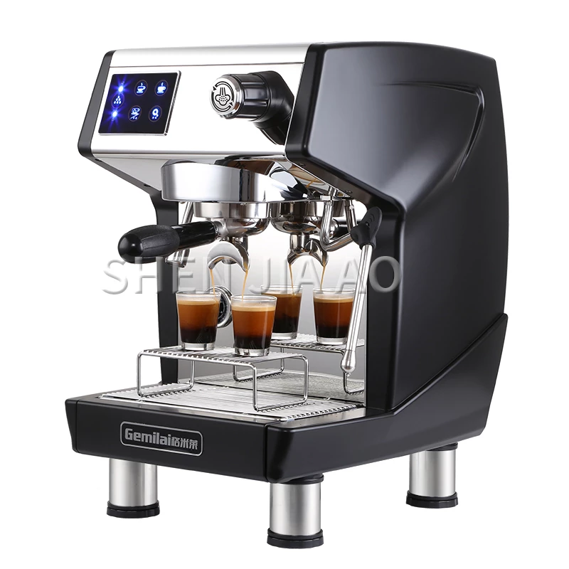

# Modelling Objects With OOP

The following assessment tests your knowledge of modelling objects with Object-Oriented Programming.

## Coffee Machine Program Requirements

You’ve just been hired CONGRATULATIONS 🎉 🎉 🎉 .

Your company asked you to create the code for a coffee machine.
Luckily for us, we don’t actually have to build the hardware because we’re programmers but we are going to use the real-life coffee machine as the inspiration for our virtual coffee machine noting its features and capabilities.



The following are the features of a coffee machine we are to model

1. Ability to make three hot coffee flavours
2. It’s coin-operated
3. It’s interactive

The coffee machine has the ability to make three hot flavours which are

- espresso
- latte
- cappuccino

Each of them requires a different quantity of water, coffee and milk. And definitely their price is different.

We are going to be modelling all this data in our coffee machine program as well, but luckily for you in the starter code, I have already included all of this data inside a `data` dictionary.
In addition, the coffee machine has some resources that it has to manage, so it starts out with 300ml of water in the tank, 200ml of milk and 100grams of coffee.

The second feature of our coffee machine is that it’s coin-operated, so we’re going to be using American coins and they have four types of coins which are the Penny, the Nickel, the Dime and the Quarter. Notice what each of these coins are worth. The penny is worth a cent ($0.01), a Nickel worth 5 cents ($0.05), a Dime worth 10 cents ($0.10) and a Quarter worth a quarter of a dollar ($0.25).

Using an object-oriented programming paradigm in python, you are to model a coffee machine described above and at least should meet the following requirements.

### Prompt user by asking “What would you like”? (espresso/latte/cappuccino)

1. Check the user’s input to decide what to do next.
2. The prompt should show every time action has been completed e.g once the drink is dispensed. The prompt should show again to serve the next customer.

### Turn off the coffee machine by entering “off” to the prompt

1. For maintainers of the coffee machine, they can use “off” as the secret word to turn off the machine. Your code should end execution when this happens.

### Print Report

1. When the user enters “report” to the prompt, a report should be generated that shows the current resource values e.g

  ```python
    water: 100ml
    Milk: 50ml
    Coffee:76g
    Money: $2.5
  ```

### Check resources sufficient?

1. When the user chooses a drink, the program should check if there are enough resources to make that drink.
2. E.g if Latte requires 200ml water but there is only 100ml left in the machine. It should not continue to make the drink but print: “Sorry there is not enough water.”
3. The same should happen if another resource is depleted e.g milk or coffee.

### Process Coins

1. If there are sufficient resources to make the drink selected, then the program should prompt the user to insert coins.
2. Remember that quarters = $0.25, dimes = $0.10, nickels = $0.05, pennies = $0.01

#### Check transaction successful?

1. Check that the user has inserted enough money to purchase the drink they selected. E.g Latte cost $2.50, but they only inserted $0.52 then after counting the coins the program should say “Sorry that’s not enough money. Money refunded”
2. But if the user has inserted enough money, then the cost of the drink gets added to the machine as the profit and this will be reflected the next time “report” is triggered. E.g.

  ```python
  water: 100ml
  Milk: 50ml
  Coffee:76g
  Money: $2.5
  ```

### Make Coffee

1. If the transaction is successful and there are enough resources to make the drink the user selected, then the ingredients to make the drink should be deducted from the coffee machine resources

2. E.g report before purchasing a latte

  ```python
  water: 300ml
  Milk: 200ml
  Coffee:100g
  Money: $0
  ```

3. Report after purchasing a latte

  ```python
  water: 100ml
  Milk: 50ml
  Coffee:76g
  Money: $2.5
  ```
